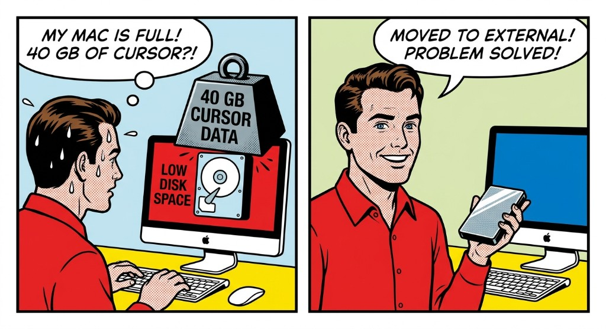

# cursor-external-drive

**Move Cursor IDE cache and user data to an external drive on macOS — free internal disk space without losing settings, extensions, or AI agent history.**

[](LICENSE)
[](#requirements)
[](#scripts)



> **cursor-external-drive** is a Bash toolkit that relocates [Cursor](https://cursor.com) (the AI code editor) from your Mac’s internal SSD to an external volume using **symlinks**. It targets the folders that grow largest: `~/Library/Application Support/Cursor/User` (often 30+ GB), `~/.cursor` (agent projects & plans), and Electron cache directories.

**Also searched as:** Cursor disk space macOS · move Cursor to external drive · Cursor `state.vscdb` too large · free space Cursor IDE · Cursor Application Support symlink · VS Code / Electron cache external SSD

---

## Table of contents

- [Why use this?](#why-use-this)
- [How it works](#how-it-works)
- [What gets moved](#what-gets-moved)
- [Requirements](#requirements)
- [Recommended external drive specs](#recommended-external-drive-specs)
- [Mount the external drive at login](#mount-the-external-drive-at-login)
- [Quick start](#quick-start)
- [Scripts reference](#scripts-reference)
- [Configuration](#configuration)
- [LaunchAgent maintenance](#launchagent-maintenance)
- [FAQ](#faq)
- [Troubleshooting](#troubleshooting)
- [Uninstall / revert](#uninstall--revert)
- [Contributing](#contributing)
- [License](#license)

---

## Why use this?

Cursor on macOS stores data in several locations under your home folder. Over months of use, especially with AI agents and extensions, the total size often reaches **40–50 GB or more** on the internal drive:

- **`state.vscdb`** — global extension and workspace state (SQLite, can exceed 30 GB)
- **`~/.cursor/projects`** — agent transcripts, MCP config, per-repo context
- **Electron caches** — `CachedData`, `GPUCache`, `Partitions`, logs

Apple Silicon Macs with small internal storage fill up quickly. This project moves that data to an **external SSD** while Cursor still reads/writes the **same paths** (`~/Library/...`, `~/.cursor`) via symlinks — no Cursor settings changes required.

**What you gain**

- Tens of GB back on the internal SSD
- Same Cursor experience (settings, keybindings, extensions, agent history)
- Idempotent scripts safe to re-run after Cursor updates
- Optional `launchd` agent to repair symlinks automatically

**Trade-offs**

- External drive must be **mounted before Cursor starts**
- Initial copy can take 20–45 minutes for large `state.vscdb` files
- Unplugging the drive while Cursor is open risks database corruption

---

## How it works

```text
Internal Mac                         External volume (/Volumes/External HD)
────────────────                     ──────────────────────────────────────
~/Library/Application Support/Cursor/
  User/          ──symlink──►         CursorCache/User/
  Cache/         ──symlink──►         CursorCache/Cache/
  CachedData/    ──symlink──►         CursorCache/CachedData/
  … (13 folders) ──symlink──►         CursorCache/…

~/.cursor/       ──symlink──►         CursorCache/dot-cursor/

~/Library/Caches/<bundle-id>/ ──►    CursorCache/<bundle-id>/
```

1. **Phase 1** — Cache folders are moved and symlinked immediately. `User` and `~/.cursor` are **copied** with `rsync` (Cursor can stay open).
2. **Phase 2** — After you quit Cursor, a final sync runs and **symlinks replace** the original `User` and `~/.cursor` directories.
3. **Maintenance** — A LaunchAgent re-applies symlinks if a Cursor update recreates real folders on the internal disk.

See [docs/architecture.md](docs/architecture.md) for paths, detection logic, and design decisions.

---

## What gets moved

| Local path | External folder | Typical size |
|------------|-----------------|--------------|
| `~/Library/Application Support/Cursor/User` | `CursorCache/User` | 1–40+ GB |
| `~/.cursor` | `CursorCache/dot-cursor` | 0.5–2 GB |
| `~/Library/Application Support/Cursor/Cache` | `CursorCache/Cache` | varies |
| `~/Library/Application Support/Cursor/CachedData` | `CursorCache/CachedData` | varies |
| `~/Library/Application Support/Cursor/GPUCache` | `CursorCache/GPUCache` | small |
| + 10 other cache dirs under `Application Support/Cursor/` | `CursorCache/…` | varies |
| `~/Library/Caches/<Cursor bundle id>/` | `CursorCache/<same name>/` | small |

**Stays on internal drive** (~10–20 MB, normal Electron runtime): `IndexedDB`, `Local Storage`, `Crashpad`, `sentry`, etc.

---

## Requirements

| Requirement | Notes |
|-------------|--------|
| **macOS** | Tested on Apple Silicon and Intel; uses `launchd`, `rsync`, `diskutil` |
| **Cursor IDE** | Installed at `/Applications/Cursor.app` |
| **External drive** | APFS or HFS+; see [recommended specs](#recommended-external-drive-specs) |
| **Free space** | Your current Cursor data + ~50 GB headroom |
| **Tools** | `bash`, `rsync` (pre-installed on macOS) |

---

## Recommended external drive specs

Cursor performs constant small reads/writes while open. A slow or sleeping drive makes the IDE feel laggy.

| Spec | Recommendation |
|------|----------------|
| **Media** | **SSD** (strongly preferred). HDD works but syncs and daily use are slower. |
| **Interface** | USB-C **3.2 (10 Gbps)+**, or **Thunderbolt 3/4 / USB4**. Avoid USB 2.0. |
| **Enclosure** | NVMe SSD in a quality enclosure, or a portable Thunderbolt SSD. |
| **Capacity** | **512 GB+** if the drive also holds repos; **256 GB** minimum for Cursor alone. |
| **Free space** | Current Cursor data **+ 50 GB** headroom. |
| **Format** | **APFS** on macOS. Avoid exFAT for symlink-heavy workloads. |
| **Power** | Direct Mac port or **powered hub** — bus-powered HDDs can disconnect under load. |

**Reliability**

- Do not unplug while Cursor is open.
- Reduce aggressive disk sleep in **System Settings → Battery / Energy**.
- Use a reliable cable; flaky connections can corrupt `state.vscdb`.

---

## Mount the external drive at login

Cursor expects the volume **before** launch. Missing drive → broken symlinks → Cursor opens with default/empty settings.

### 1. Leave the drive connected

macOS usually remounts known APFS/HFS+ volumes at boot. **Open Cursor only after** the volume appears in Finder or `/Volumes/`.

### 2. Confirm mount in Finder

**System Settings → Desktop & Dock** — show **External disks** on desktop.

### 3. Auto-mount at login (optional)

If the disk is connected but not mounted:

1. Set `CURSOR_EXTERNAL_VOLUME` in `config.env` (exact Finder name, e.g. `/Volumes/External HD`).
2. Add the mount helper to **System Settings → General → Login Items** (before Cursor):

```bash
chmod +x ~/Library/Scripts/cursor-external-drive/mount-external-volume.sh
# Login Items → + → select mount-external-volume.sh
```

### 4. Startup order

1. Mac boots (drive connected)
2. Volume appears under `/Volumes/`
3. LaunchAgent runs `setup-cursor-cache.sh` (if installed)
4. Open Cursor

Unlock **FileVault** or encrypted APFS volumes before starting Cursor.

---

## Quick start

```bash
git clone https://github.com/sylvestrelucia/cursor-external-drive.git
cd cursor-external-drive
./install.sh
```

Edit `~/.config/cursor-external-drive/config.env`:

```bash
CURSOR_EXTERNAL_VOLUME="/Volumes/External HD"
CURSOR_EXTERNAL_BASE="${CURSOR_EXTERNAL_VOLUME}/CursorCache"
```

### Migration

**Phase 1** — cache symlinks + copy user data (Cursor can stay open):

```bash
~/Library/Scripts/cursor-external-drive/setup-cursor-cache.sh
```

**Phase 2** — quit Cursor (`Cmd+Q`), then finalize:

```bash
~/Library/Scripts/cursor-external-drive/finalize-cursor-data.sh
```

**Verify:**

```bash
~/Library/Scripts/cursor-external-drive/verify-cursor-external-drive.sh
```

---

## Scripts reference

| Script | Purpose |
|--------|---------|
| [`setup-cursor-cache.sh`](scripts/setup-cursor-cache.sh) | Main migration: cache symlinks + sync/move user data |
| [`sync-cursor-data.sh`](scripts/sync-cursor-data.sh) | Copy only `User` + `~/.cursor` |
| [`finalize-cursor-data.sh`](scripts/finalize-cursor-data.sh) | Final sync + symlink swap (Cursor quit required) |
| [`verify-cursor-external-drive.sh`](scripts/verify-cursor-external-drive.sh) | Health check for symlinks and readability |
| [`mount-external-volume.sh`](scripts/mount-external-volume.sh) | Mount configured volume (Login Items) |
| [`watch-and-finalize-cursor-data.sh`](scripts/watch-and-finalize-cursor-data.sh) | Wait for Cursor quit, then finalize |
| [`install.sh`](install.sh) | Install scripts + LaunchAgent |
| [`uninstall.sh`](uninstall.sh) | Remove LaunchAgent |

All scripts load `~/.config/cursor-external-drive/config.env` (from [`config.example.env`](config.example.env)).

---

## Configuration

```bash
CURSOR_EXTERNAL_VOLUME="/Volumes/External HD"
CURSOR_EXTERNAL_BASE="${CURSOR_EXTERNAL_VOLUME}/CursorCache"
CURSOR_DOT_CURSOR_DIR="dot-cursor"
CURSOR_SCRIPTS_DIR="${HOME}/Library/Scripts/cursor-external-drive"
CURSOR_LAUNCHD_LABEL="com.example.cursor-external-drive"
# CURSOR_APP_CACHE_NAME="com.todesktop.XXXXXXXXXX"  # optional; auto-detected
```

Override config path:

```bash
CURSOR_EXTERNAL_CONFIG=/path/to/config.env ./scripts/setup-cursor-cache.sh
```

The `~/Library/Caches/…` folder name is Cursor’s **CFBundleIdentifier**, auto-detected from `/Applications/Cursor.app`.

---

## LaunchAgent maintenance

`install.sh` registers a `launchd` agent that re-runs `setup-cursor-cache.sh` at login and every hour **when the volume is mounted**. This fixes symlinks after Cursor updates recreate internal folders.

- **Log:** `~/Library/Logs/cursor-external-drive-setup.log`
- **Remove:** `./uninstall.sh`

> Scripts must live on the **internal drive** (`~/Library/Scripts/…`). macOS LaunchAgents often fail with `Operation not permitted` when executing scripts directly from external volumes.

---

## FAQ

### Does this work with VS Code?

This project targets **Cursor** paths and bundle IDs. The same symlink pattern applies to VS Code (`~/Library/Application Support/Code`), but paths and scripts differ — do not run these scripts unmodified on VS Code.

### Will Cursor updates break symlinks?

Sometimes Cursor recreates cache directories on the internal disk after an update. Re-run `setup-cursor-cache.sh` or rely on the LaunchAgent.

### Can I use iCloud / network drives?

Not recommended. Cursor expects fast, locally attached storage. Network latency and disconnects risk corrupting `state.vscdb`.

### How long does migration take?

Cache symlinks: seconds. Copying `User` + `~/.cursor`: **10–45+ minutes** depending on `state.vscdb` size and drive speed (SSD vs HDD).

### Is my data deleted from the internal drive?

After finalize, the internal copies are **removed** and replaced by symlinks. Data lives on the external drive. Keep backups until you verify with `verify-cursor-external-drive.sh`.

### Does this send data anywhere?

No. Pure local shell scripts — no network calls, no telemetry.

---

## Troubleshooting

| Symptom | Fix |
|---------|-----|
| `Operation not permitted` on external volume | Run scripts from `~/Library/Scripts/cursor-external-drive/` after `install.sh`. Grant **Full Disk Access** to Terminal for `state.vscdb` rsync. |
| Cursor opens with default settings | Mount external drive → restart Cursor → run `verify-cursor-external-drive.sh`. |
| Large / locked `state.vscdb` | Quit Cursor completely before finalize. Phase 1 copy can run while Cursor is open but may skip locked bytes until quit. |
| LaunchAgent not running | Check `launchctl list \| grep cursor-external-drive` and log file above. |

More detail: [docs/troubleshooting.md](docs/troubleshooting.md)

---

## Uninstall / revert

1. Quit Cursor.
2. Copy data back from the external drive:
   ```bash
   rsync -a "/Volumes/External HD/CursorCache/User/" "$HOME/Library/Application Support/Cursor/User-restored/"
   rsync -a "/Volumes/External HD/CursorCache/dot-cursor/" "$HOME/.cursor-restored/"
   # Remove symlinks; rename *-restored folders to User and .cursor
   ```
3. Run `./uninstall.sh`; optionally remove `~/Library/Scripts/cursor-external-drive/`.

---

## Contributing

Bug reports, docs improvements, and pull requests are welcome. See [CONTRIBUTING.md](CONTRIBUTING.md).

---

## License

[MIT](LICENSE) — see [LICENSE](LICENSE) for details.
