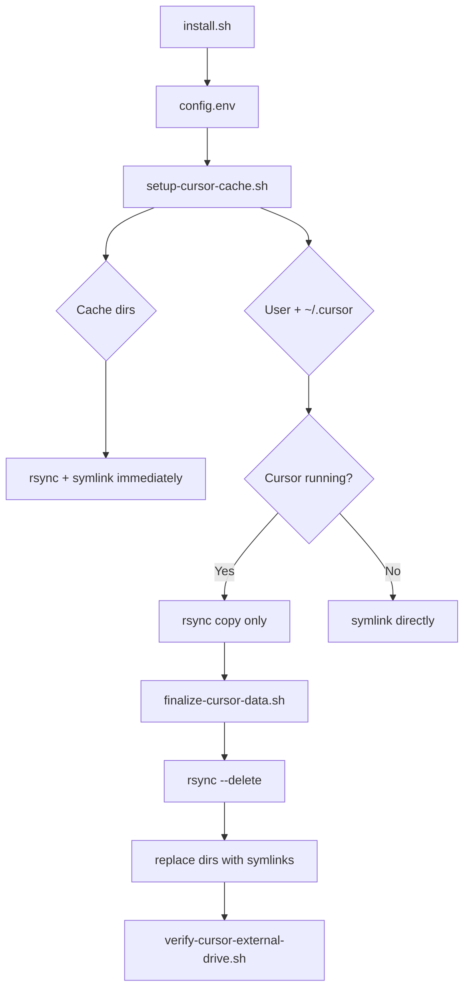

# Architecture

How **cursor-external-drive** relocates Cursor data on macOS without modifying the Cursor application itself.

## Design principles

1. **Symlinks, not config hacks** — Cursor always uses default paths (`~/Library/Application Support/Cursor`, `~/.cursor`). We replace directories with symlinks to an external volume.
2. **Idempotent** — Re-running scripts skips paths already linked correctly; fixes wrong targets.
3. **Two-phase user migration** — Large SQLite databases (`state.vscdb`) copy while Cursor runs; symlink swap only after quit to avoid locks and corruption.
4. **Internal script install** — LaunchAgents execute from `~/Library/Scripts/` because macOS TCC often blocks scripts on external volumes.

## Directory layout (external)

```text
/Volumes/<Your Volume>/CursorCache/
├── User/                    ← Application Support/Cursor/User
├── dot-cursor/              ← ~/.cursor
├── Cache/
├── CachedData/
├── GPUCache/
├── Code Cache/
├── CachedExtensionVSIXs/
├── CachedProfilesData/
├── CachedConfigurations/
├── DawnGraphiteCache/
├── DawnWebGPUCache/
├── logs/
├── Partitions/
├── WebStorage/
├── VideoDecodeStats/
└── <CFBundleIdentifier>/    ← ~/Library/Caches/<bundle id>
```

## Migration flow



## App cache detection

`scripts/lib.sh` resolves the `~/Library/Caches/…` folder name:

1. `CURSOR_APP_CACHE_NAME` from config (if set)
2. `CFBundleIdentifier` from `/Applications/Cursor.app/Contents/Info`
3. First `~/Library/Caches/com.todesktop.*` directory (excluding `.ShipIt`)

## LaunchAgent

Label: `{CURSOR_LAUNCHD_LABEL}.cache-symlinks`

- **RunAtLoad:** yes
- **StartInterval:** 3600 seconds
- **Condition:** external volume directory exists
- **Action:** run `setup-cursor-cache.sh`

Does **not** mount the disk — use `mount-external-volume.sh` in Login Items for that.

## What stays internal

Small Electron/Chromium runtime stores (~10–20 MB total):

- `IndexedDB/`
- `Local Storage/`
- `Session Storage/`
- `Crashpad/`
- `sentry/`

These are not symlinked by design; moving them offers little space savings and can complicate crash reporting.

## Compatibility

| Component | Support |
|-----------|---------|
| macOS 12+ | Expected to work |
| Cursor (ToDesktop/Electron build) | Primary target |
| VS Code | Not supported (different paths) |
| Linux / Windows | Out of scope |
